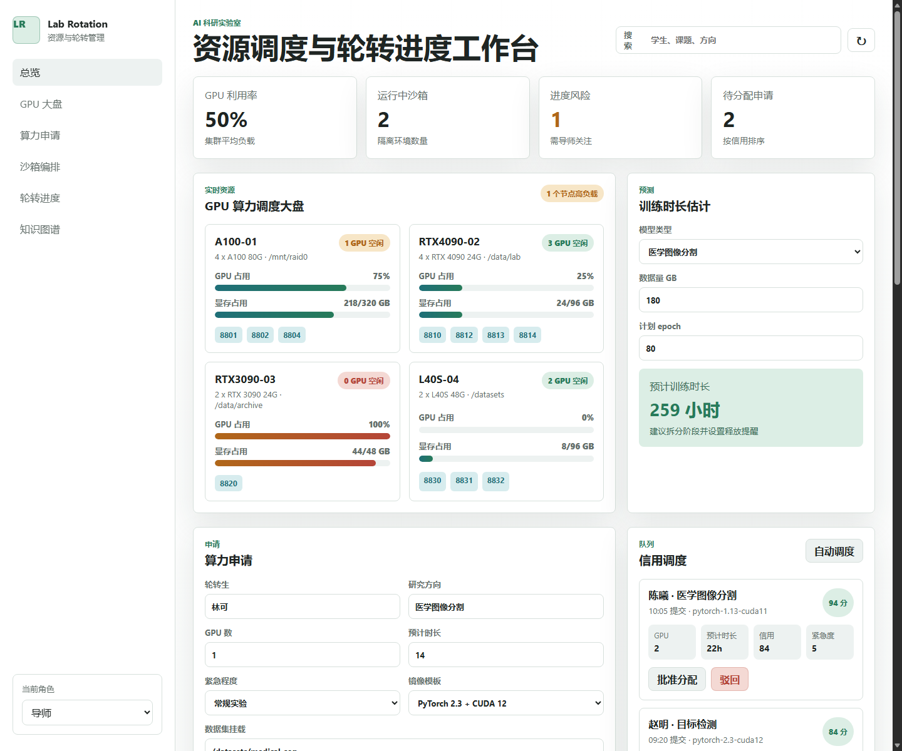
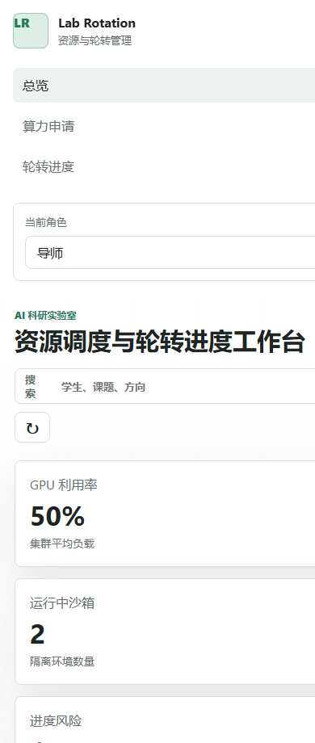

# 实验室资源与轮转进度管理系统 MVP

这是根据项目文档落地的前端 MVP，用于演示 AI 科研实验室中“算力资源分配”和“轮转进度管理”的核心闭环。当前版本不依赖后端和安装包，直接打开 `index.html` 即可运行。

## MVP 范围

- GPU 算力大盘：展示节点 GPU 占用、显存占用、空闲端口和挂载目录。
- 训练时长预测：按模型类型、数据量和 epoch 估算训练耗时。
- 信用调度队列：提交算力申请后，按紧急程度、信用分、GPU 数和时长排序。
- 沙箱编排：批准申请后自动生成容器记录，分配节点和端口，支持暂停、恢复、快照、释放。
- 轮转 WBS：按学生展示阶段进度、GPU 消耗和进度风险提醒。
- 导师评价：按代码提交、算力效率、按期完成三个维度生成综合评分。
- 科研知识图谱：按研究方向展示历史接力关系、典型问题、解决方案和代码分支。

## 运行方式

在浏览器中打开：

```text
E:\codesource\MVP\index.html
```

也可以在本目录启动任意静态文件服务，但不是必需的。

## 预览

桌面端：



移动端：



## 后续接入点

- 将 `app.js` 中的模拟 `state` 替换为后端 API。
- GPU 状态可对接 `nvidia-smi`、Prometheus 或现有集群监控接口。
- 沙箱操作可对接 Docker Engine API 或 Kubernetes Job。
- 日志与代码归档可对接 GitHub API，并把知识条目持久化到数据库。
- 训练时长预测可替换为基于历史任务的回归模型。
