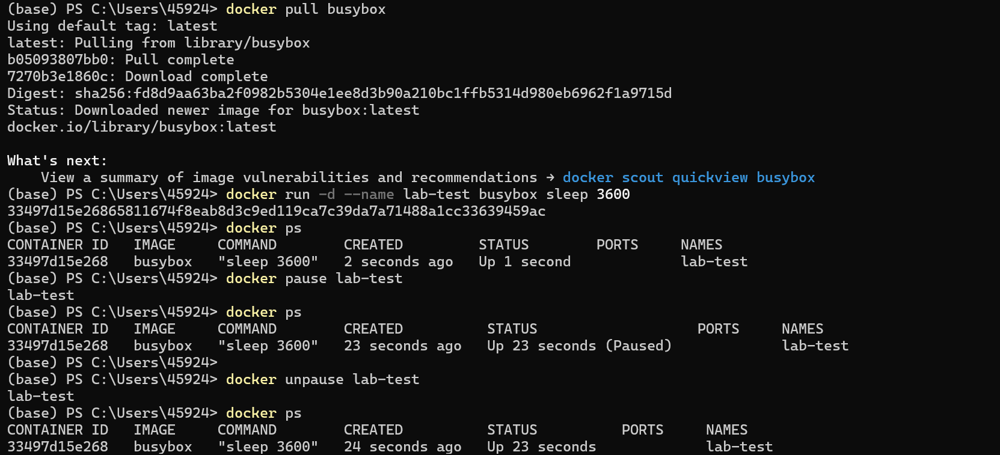
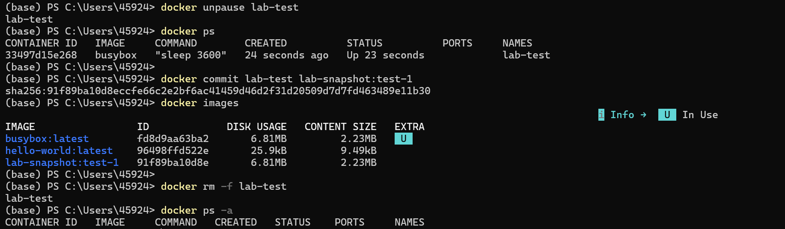
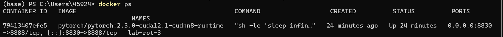
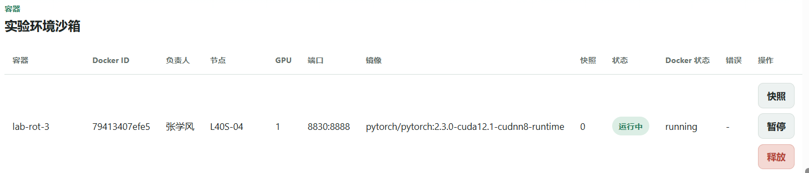

# Docker 实机验收报告

## 1. 验收结论

本项目 Docker 部分已完成实机验证。验收结果表明：后端能够通过 Docker CLI 创建真实容器，页面沙箱表格能够展示 Docker 容器 ID、镜像、端口映射和运行状态，终端 `docker ps` 输出与页面记录一致。

本次验收覆盖两类证据：

- Docker 本机能力验证：使用 `busybox` 完成容器创建、暂停、恢复、快照和释放。
- 项目集成验证：在页面点击“批准分配”后，系统创建真实 PyTorch/CUDA 容器 `lab-rot-3`，并写入沙箱记录。

## 2. 验收环境

| 项目 | 结果 |
| --- | --- |
| 验收机器 | 本机 Windows 环境 |
| Docker Engine | 可用 |
| Docker Desktop | 已启动 |
| 项目服务 | `http://localhost:3000` |
| 项目后端 | Node.js + SQLite + Docker CLI |
| 数据库 | `data/lab_resource.db` |

## 3. Docker 本机能力验证

| 步骤 | 命令或操作 | 结果 | 证据 |
| --- | --- | --- | --- |
| 拉取轻量镜像 | `docker pull busybox` | 成功拉取 `busybox:latest` | `Docker-01-manual-create-pause-unpause.png` |
| 创建容器 | `docker run -d --name lab-test busybox sleep 3600` | 成功创建容器 `lab-test` | `Docker-01-manual-create-pause-unpause.png` |
| 查看运行状态 | `docker ps` | 容器状态为 `Up` | `Docker-01-manual-create-pause-unpause.png` |
| 暂停容器 | `docker pause lab-test` | 容器状态变为 `Paused` | `Docker-01-manual-create-pause-unpause.png` |
| 恢复容器 | `docker unpause lab-test` | 容器恢复为 `Up` | `Docker-01-manual-create-pause-unpause.png` |
| 创建快照 | `docker commit lab-test lab-snapshot:test-1` | 生成快照镜像 | `Docker-02-manual-snapshot-release.png` |
| 查看镜像 | `docker images` | 出现 `lab-snapshot:test-1` | `Docker-02-manual-snapshot-release.png` |
| 释放容器 | `docker rm -f lab-test` | 容器被删除 | `Docker-02-manual-snapshot-release.png` |
| 验证释放 | `docker ps -a` | 不再显示 `lab-test` | `Docker-02-manual-snapshot-release.png` |

## 4. 项目集成验证

页面点击“批准分配”后，项目后端执行 Docker 创建流程，并生成如下沙箱记录：

| 字段 | 页面结果 | Docker 终端结果 |
| --- | --- | --- |
| 容器名 | `lab-rot-3` | `lab-rot-3` |
| Docker ID | `79413407efe5` | `79413407efe5` |
| 镜像 | `pytorch/pytorch:2.3.0-cuda12.1-cudnn8-runtime` | `pytorch/pytorch:2.3.0-cuda12.1-cudnn8-runtime` |
| 端口映射 | `8830:8888` | `0.0.0.0:8830->8888/tcp` |
| 页面状态 | `运行中` | `Up 24 minutes` |
| Docker 状态 | `running` | `Up 24 minutes` |

证据文件：

- 页面沙箱截图：`Docker-04-project-sandbox-running.png`
- 终端 `docker ps` 截图：`Docker-03-project-docker-ps.png`

## 5. 证据截图预览

### 5.1 手动 Docker 创建、暂停、恢复

### 5.2 手动 Docker 快照、释放

### 5.3 项目创建容器后的 docker ps

### 5.4 项目沙箱运行状态

## 6. 与项目功能的对应关系

| 页面功能 | 后端动作 | Docker 命令 |
| --- | --- | --- |
| 批准分配 | 创建沙箱记录并写入 SQLite | `docker run -d ...` |
| 暂停 | 更新沙箱状态 | `docker pause <container>` |
| 恢复 | 更新沙箱状态 | `docker unpause <container>` |
| 快照 | 生成快照镜像并记录版本 | `docker commit <container> lab-snapshot:*` |
| 释放 | 删除容器并释放端口 | `docker rm -f <container>` |

## 7. 验收判断

Docker 部分满足 MVP 验收要求：

- 容器不是页面模拟数据，而是真实 Docker 容器。
- 页面沙箱记录与 `docker ps` 输出可以相互对应。
- 容器 ID、镜像、端口映射、运行状态均可追溯。
- 手工 Docker 生命周期验证已覆盖创建、暂停、恢复、快照和释放。

后续如果部署到实验室 GPU 服务器，可继续验证多用户隔离、GPU 容器资源限制和 Kubernetes 集群调度。本次 MVP 阶段不把 Kubernetes 作为必需范围。
